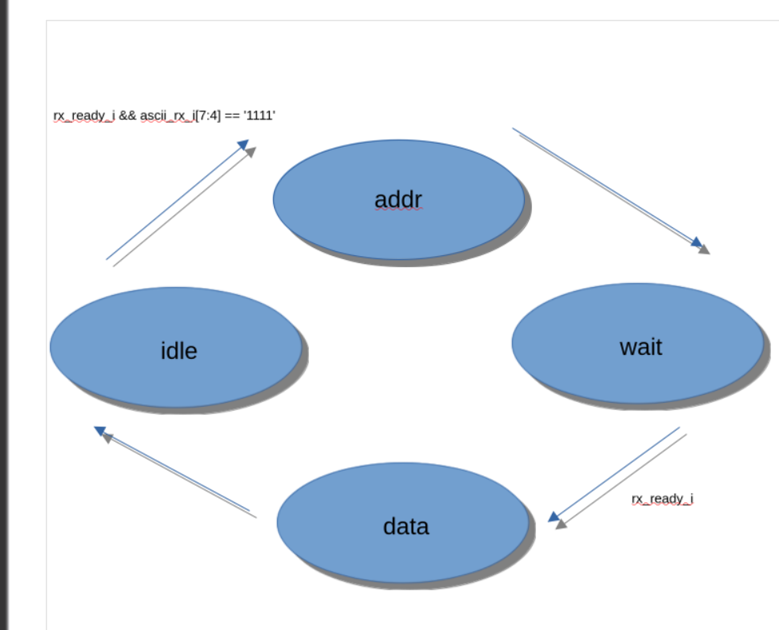

# `integration_uart_core_e` / `_a` Data Sheet

Purpose
- UART command decoder that writes to the register file interface.
- Consumes two UART bytes: address command, then data byte.

Protocol
- Address byte: upper nibble must be `1111` (`prefix_cmd_c`), lower nibble is register address.
- Data byte: payload to write.
- Output is a one-cycle write strobe to the regfile.

Ports
- `clk_i` (in): system clock, rising-edge.
- `rst_n_i` (in): active-low async reset.
- `ascii_rx_i` (in): received UART byte (8 bits).
- `rx_ready_i` (in): pulse high for one cycle when a byte is valid.
- `reg_wr_addr_o` (out): latched address nibble for regfile.
- `reg_data_in_o` (out): data byte for regfile.
- `reg_wr_en_o` (out): write enable pulse to regfile (one cycle).

Internal Signals / Registers
- `state_q_s`: current FSM state (`idle_st`, `addr_st`, `wait_data_st`, `data_st`).
- `state_d_s`: next-state signal.
- `addr_q_s`: latched address nibble.

Processes
- `state_ff_p`: clocked state register with async reset to `idle_st`.
- `next_state_p`: combinational next-state logic.
- `output_logic_p`: combinational outputs and address latch based on `state_q_s`.

Operation (state flow)
- `idle_st`: wait for address byte with prefix `1111`; on match, go to `addr_st`.
- `addr_st`: latch lower nibble into `addr_q_s`; go to `wait_data_st`.
- `wait_data_st`: wait for next `rx_ready_i`; on pulse, go to `data_st`.
- `data_st`: drive `reg_wr_en_o='1'`, `reg_wr_addr_o=addr_q_s`, `reg_data_in_o=ascii_rx_i`; then return to `idle_st`.
- Reset drives state to `idle_st` and deasserts outputs.
Notes
- Write path is serial over UART (address byte with `1111` prefix, then data byte).
- Regfile read path is not clocked by this core; reads are external via `top_level`.

FSM Diagram

