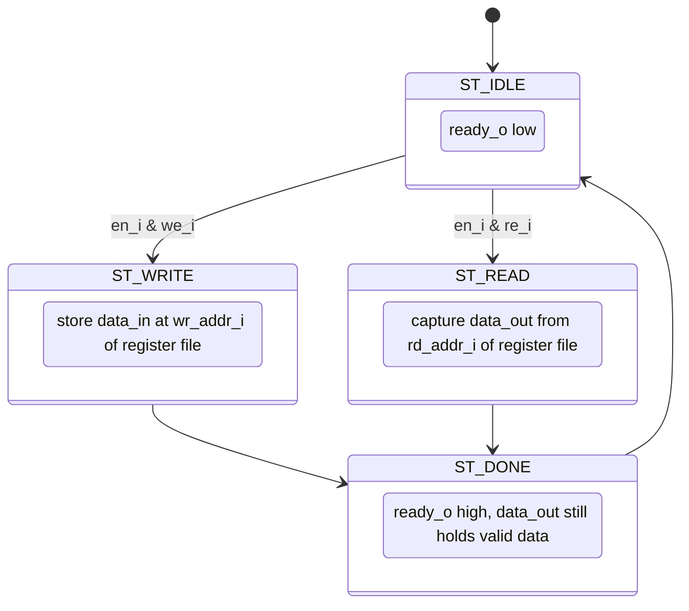

# FSM State Diagram

The state machine captures requests in `ST_IDLE`, performs the operation, then exposes a one-cycle `ready_o` pulse in `ST_DONE` before returning to idle.

```mermaid
stateDiagram-v2
    [*] --> ST_IDLE
    state ST_IDLE {
        ready_low: ready_o low
    }
    state ST_WRITE {
        write_action: store data_in at wr_addr_i of register file
    }
    state ST_READ {
        
        read_action: capture data_out from rd_addr_i of register file
    }
    state ST_DONE {
        ready_high: ready_o high, data_out still holds valid data
    }

    ST_IDLE --> ST_WRITE : en_i & we_i
    ST_IDLE --> ST_READ  : en_i & re_i
    ST_WRITE --> ST_DONE
    ST_READ --> ST_DONE
    ST_DONE --> ST_IDLE
```
