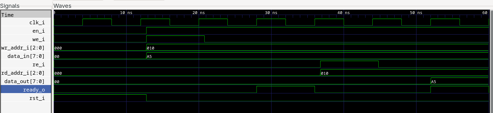

# Register File Usage

## Overview
- Name: `fsm_3block_regfile`
- Settings:
  - `width_g`: how many bits in each register (default 8)
  - `count_g`: how many registers (default 8)

## States
- `ST_IDLE`: wait for a request; `ready_o` is low. If both read and write are high, write wins.
- `ST_WRITE`: decode `wr_addr_i`, enable one register, and load `data_in` on this clock
- `ST_READ`: read from register and put it in `data_out`
- `ST_DONE`: `ready_o` is high for one clock, then go back to idle

## How it works
- Each register is a flip-flop cell (`ifx_reg_cell_e`).

## Ports
- `clk_i`: clock
- `rst_i`: reset, clears everything
- `en_i`: enable, must be high to work
- `we_i`: write request, checked in idle
- `re_i`: read request, checked in idle
- `wr_addr_i`: write address, decoded only in the write state
- `rd_addr_i`: read address, decoded only in the read state
- `data_in`: data to write, sampled in the write state
- `data_out`: data you read, valid in and after done (ready_o = 1)
- `ready_o`: high for one clock in done, shows request is finished

## How to use
1. Set `en_i = '1'` and set `we_i` or `re_i` (not both) with address and data
2. Keep the request for one clock so the machine sees it in idle
3. After the clock, turn off the request; the machine goes to write (or read if only `re_i` was high), then done
4. On the next clock, check `ready_o = '1'`. If you read, get `data_out` now if it was a read request otherwise it is just a confirmation we wrote data successfully.
5. The machine goes back to idle, ready for the next request

### Example timeline
- **Cycle 0 (ST_IDLE)**: `en_i=1`, `we_i=1`, `re_i=0`, `wr_addr_i="010"`, `data_in=x"A5"`. FSM sees request at rising edge.
- **Cycle 1 (ST_WRITE)**: Register 2 loads `A5`. `we_i` can drop to 0 now.
- **Cycle 2 (ST_DONE)**: `ready_o=1` for one clock. User knows write finished.
- **Cycle 3 (ST_IDLE)**: Ready for next request. Suppose `re_i=1`, `we_i=1`, `rd_addr_i="010"`.
- **Cycle 4 (ST_READ)**: Data from register 2 moves into `data_out`.
- **Cycle 5 (ST_DONE)**: `ready_o=1` again; user samples `data_out=A5`.

Below is the timing digram of the example timeline described above:

## Simulation
- Run `./run_ifx_regfile_tb.sh --clean --gui` to build and test
- The testbench checks reset, read-after-write, and the ready signal
